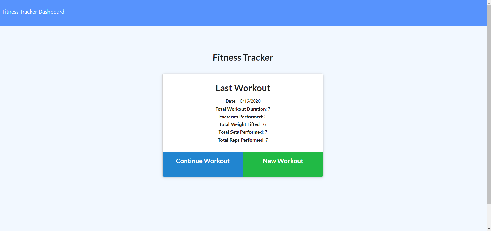
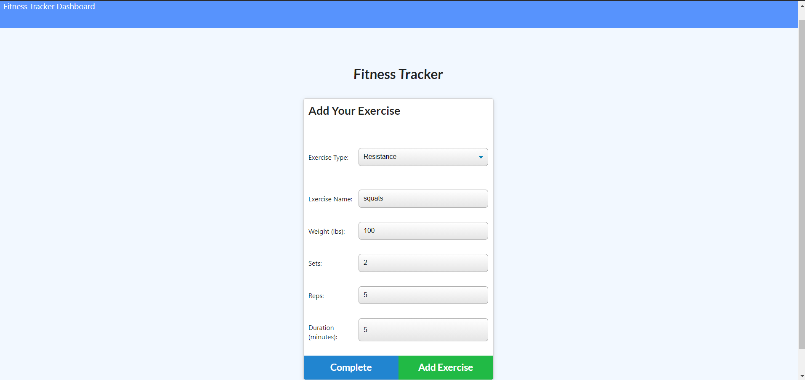
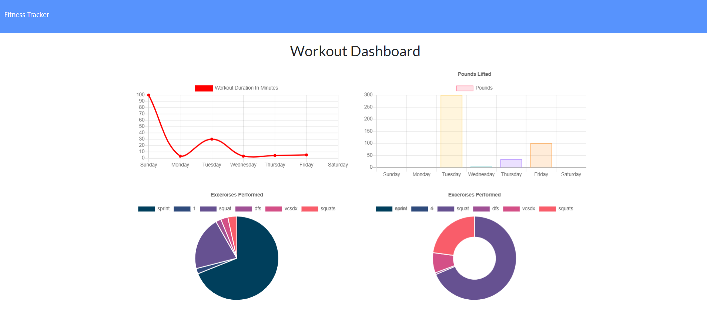

# Workout-Tracker 

## Description
This application uses mongoDB, mongoose, morgan, and express to allow users to create their own workouts and provide visual feedback on their exercises.
### Table of Contents
-  [Title](#title)

-  [Description](#description)

-  [Installation](#installation)

-  [Features](#features)

-  [License](#license)

-  [Contributors](#contributors)

-  [Questions](#questions)
            
## Installation
1. Clone this repo
2. Run `npm init`
3. Run `npm install`
4. Connect the project to mongoDB
5. Ensure this project is running on a working port
6. Run `node server.js`

## Features
- Mongoose schema and seed file
- Models for index and workouts
- GET, POST, and PUT call back functions
- Express.js used to handle routes

## License

## Contributing
No contributors yet but feel free to make a pull request.

## Questions
If anyone has any questions about my application please contact me below.

reedsantos@icloud.com

[Github link](https://github.com/ReedSantos)
